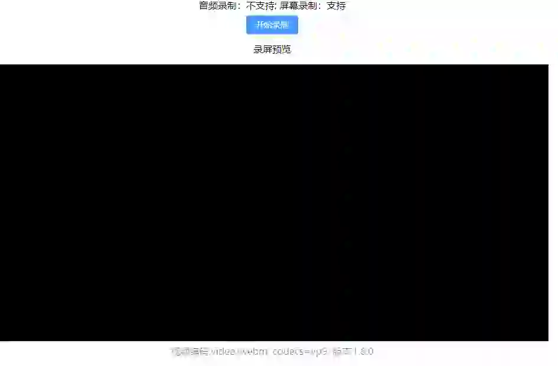

# Vue 3 Screen Recording

### Language
- [English](README.md) | [中文](README_CH.md)

## Demo




**Live Demo**: [https://1245040330.github.io/vue3-screen-recording/](https://1245040330.github.io/vue3-screen-recording/)

## Overview

A powerful and user-friendly screen recording tool built with Vue 3, allowing users to record their screen and audio with ease. This project leverages modern web APIs and Vue 3 composition API to provide a seamless recording experience.

## Features

- **Screen Recording**: Capture your entire screen or specific windows/tabs
- **Audio Recording**: Support for microphone input (if available)
- **Real-time Preview**: Live preview of the recording content
- **Multiple Video Formats**: Automatically selects the best supported video codec
- **Duration Fix**: Automatically fixes WebM video duration issues
- **One-click Download**: Recordings are saved as WebM files with timestamps

## Technical Stack

- **Frontend Framework**: Vue 3
- **UI Library**: Element Plus
- **Utility Library**: VueUse Core
- **File Handling**: FileSaver.js
- **WebM Fix**: webm-duration-fix
- **Styling**: SCSS, Tailwind CSS

## Project Setup

```bash
# Install dependencies
npm install

# Compiles and hot-reloads for development
npm run serve

# Compiles and minifies for production
npm run build
```

## How to Use

1. **Check Compatibility**: The tool will automatically detect if your browser supports screen and audio recording
2. **Start Recording**: Click the "Start Recording" button
3. **Select Source**: Choose the screen, window, or tab you want to record
4. **Record**: The tool will start recording immediately
5. **Stop Recording**: Click the "Stop Recording" button when finished
6. **Preview & Download**: A new window will open with the recording, and it will be automatically downloaded

## Video Conversion

The recorded videos are saved in WebM format. You can convert them to MP4 using FFmpeg:

```bash
ffmpeg -i input.webm output.mp4
```

## Browser Compatibility

- Chrome 72+
- Firefox 66+
- Edge 79+
- Safari 13.1+

## Version Information

- Current Version: 1.0.1
- Last Updated: 2026-01-29

## License

MIT License
