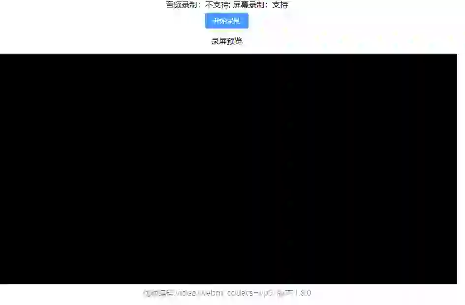
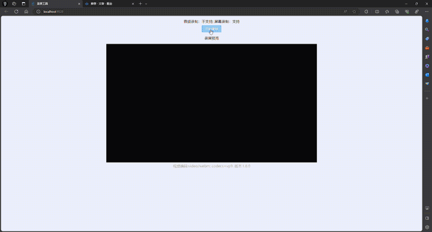

# Vue 3 屏幕录制工具

### 语言
- [中文](README_CH.md) | [English](README.md)

## 演示





**在线演示**：[https://1245040330.github.io/vue3-screen-recording/](https://1245040330.github.io/vue3-screen-recording/)

## 项目概述

一个功能强大且用户友好的屏幕录制工具，基于 Vue 3 开发，允许用户轻松录制屏幕和音频。该项目利用现代 Web API 和 Vue 3 组合式 API 提供无缝的录制体验。

## 功能特性

- **屏幕录制**：捕获整个屏幕或特定窗口/标签页
- **音频录制**：支持麦克风输入（如果可用）
- **实时预览**：录制内容的实时预览
- **多种视频格式**：自动选择最佳支持的视频编码
- **时长修复**：自动修复 WebM 视频时长问题
- **一键下载**：录制内容以带时间戳的 WebM 文件形式保存

## 技术栈

- **前端框架**：Vue 3
- **UI 库**：Element Plus
- **工具库**：VueUse Core
- **文件处理**：FileSaver.js
- **WebM 修复**：webm-duration-fix
- **样式**：SCSS、Tailwind CSS

## 项目设置

```bash
# 安装依赖
npm install

# 编译并热重载开发环境
npm run serve

# 编译并压缩生产环境
npm run build
```

## 使用方法

1. **检查兼容性**：工具会自动检测浏览器是否支持屏幕和音频录制
2. **开始录制**：点击"开始录制"按钮
3. **选择源**：选择要录制的屏幕、窗口或标签页
4. **录制**：工具会立即开始录制
5. **停止录制**：完成后点击"停止录制"按钮
6. **预览和下载**：会打开一个新窗口显示录制内容，并自动下载

## 视频转换

录制的视频以 WebM 格式保存。您可以使用 FFmpeg 将其转换为 MP4：

```bash
ffmpeg -i input.webm output.mp4
```

## 浏览器兼容性

- Chrome 72+
- Firefox 66+
- Edge 79+
- Safari 13.1+

## 版本信息

- 当前版本：1.0.1
- 最后更新：2026-01-29

## 许可证

MIT License
